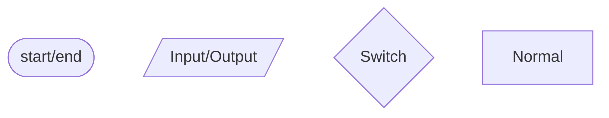

# Functional

---

## 3.1

Algorithm

---

计算机算法：指令的有限序列。

- 数值算法：大数据量计算，但逻辑相对简单
- 非数值算法：大数据量管理，逻辑相对复杂但计算比较简单

---

算法的基本特征

- 输入 Input 0-n
- 输出 Output 1-n
- 确定性 Certainty: Same Input ---> Same Output
- 有穷性 Limited **Steps** and **Time**
- 有效性 By definite steps of realized elementary operations

---

程序

- 数据的描述（数据结构）：在程序中指定的数据类型和组织方式
- 操作的描述（算法）：对动作的描述

程序的结构

- 顺序
- 分支
- 循环

条件

- 单入单出
- 每一部分**都可以**被执行
- 不存在死循环

---

流程图表示程序



---

两种循环

- 当型循环
- 直到型循环（至少执行一次）

---

## 3.2

cpp program

---

- ``*.h``
- ``*.cpp``
    - 预处理指令
    - 全局声明
    - 若干函数
        - 声明语句：Define a Variable
        - 执行语句
            - 控制语句
                - ``if else``
                - ``switch case``
                - ``break``
                - ``goto``
                - ``for``
                - ``while``
                - ``do while``
                - ``continue``
                - ``return``
            - 函数和流对象调用语句
                - ``max(a,b);``
                - ``std::cout << x << std::endl;``
            - 表达式语句 ``;``
                - 算术表达式
                - 赋值表达式
                - 逗号表达式
        - 空语句：``;``
        - 复合语句：``{ ... }``

---

语句和表达式的区别

```cpp
#include <iostream>
using namespace std;
int main()
{
    int a;
    (a=3)*10; // get 30(left val)
    (a=3;)*10; // ERROR!
    return 0;
}
/*
warning: "*"
error: syntax error: ";"
error: syntax error: ")"
error: 非法间接寻址
*/
```

---

流：来自设备或传给设备的一个数据流，由一系列字节组成，按顺序排列。

C/CPP 原生标准没有输入输出

```c
#include <stdio.h>
// scanf(), printf()
```

```cpp
#include <iostream>
// std::cin >> 流提取
// std::cout << 流插入
```

---

```cpp
cout << sta1 << sta2 << sta3 << endl;
```

插入的数据存储在缓冲区中，在下面三种情况输出：

1. 缓冲区满
2. 遇到换行符 ``'\n', std::endl`` （在 Windows OS 不被严格执行，在 Linux OS 中被严格执行）
3. 强制输出 ``cout.flush()``

```cpp
#include <iostream>
#include <Windows.h>
//Sleep()
int main()
{
    std::cout << "12345";
    Sleep(1000*5); // ms
    std::cout << "abcde" << std::endl;
    return 0;
}
```

```cpp
#include <iostream>
#include <unistd.h>
//sleep()
int main()
{
    std::cout << "12345";
    sleep(5); // s
    std::cout << "abcde" << std::endl;
    return 0;
}
```

---

输出重定向

---

```cpp
#include <iostream>
using namespace std;
int main()
{
    int a=10, b=15, c=20;
    cout << a, b, c; // Output: 10 逗号表达式
    return 0;
}
```

---

输出流自动识别变量类型

```cpp
#include <iostream>
using namespace std;
int main()
{
    char a = 65;
    cout << a+0 << endl; // Output: 65 type conversion
    return 0;
}
```

---

输入流

``cin >> var1 >> var2 >> var3;

输入的终止条件：空格，换行，非法输入

可以判断是否成功输入

```cpp
cin.good();
cin.fail();
/*
一般来说两个语句结果互斥
在文件读写的时候可能出现都为 0 的情况
*/
```

当 ``cin.good()==1`` 或 ``cin.fail()==0`` 时，变量的值不可信，不讨论。

---

```cpp
#include <iostream>
using namespace std;
int main()
{
    unsigned short k;
    cin >> k;
    cout << "k=" << k << endl;
    cout << "good=" << cin.good() << endl;
    cout << "fail=" << cin.fail() << endl;
}
```

不超过 ``short`` 的上下限，就正确，超过就错误。

输入和赋值的区别：

同样超数据范围，两种语句的处理不同。

- ``cin``：``good()`` 为 0，结果不可信
- 赋值：截断

如果输入 ``float`` 超范围，则 ``cin.good()==0``.

---

格式化控制符

```cpp
#include <iostream>
#include <iomanip>
using namespace std;
int main()
{
    int b = 123456;
    cout << b << endl;
    cout << hex << b << endl; // 1e240
    cout << setiosflags(ios::uppercase) << b << endl; // keep hex! 1E240
    cout << dec;
    cout << setw(10) << b << ',' << b << endl; // valid for just one time
    cout << setfill('*') << setw(10) << b << endl; // ' ' by default
    cout << setfill('*') << setw(10) << setiosflags(ios::left) << b << endl; // ' ' by default
    cout << setiosflags(ios::showpos) << b << endl; // show positive

    double a = 123.456789012345;
    cout << setprecision(9) << a << endl; // 默认是有效数字位数
    cout << setprecision(6);
    cout << setiosflags(ios::fixed) << a << endl; // 修改成小数点后位数

    return 0;
}
```

---

``putchar()``

```cpp
    cout << putchar('A') << endl;
    cout << sizeof(putchar('A')) << endl;
    cout << typeid(putchar('A')).name() << endl;
```

---

``getchar()``

``cin``, ``getchar()`` 每次只在缓冲区中读取复合要求的部分，**剩下的留在缓冲区中供下一次读取**。

程序执行完成以后会释放缓冲区。

---

```cpp
#include <iostream>
#include <conio.h>
using namespace std;
int main()
{
    char ch;
    ch = getchar(); // Need enter, has echo
    cout << ch << endl;
    ch = _getch(); // No echo, No enter, getch() in Dev c++
    cout << ch << endl;
    ch = _getche(); // Has echo, No enter, getche() in Dev c++
    cout << ch << endl;
    return 0;
}
```

---

关系表达式

- ``> < >= <=`` (8) L-R

- ``== !=`` (9) L-R

实数参与运算时要考虑误差。

```cpp
#include <cmath>
int main()
{
    float b = 1.1F;
    std::cout << (b==1.1) << std::endl;
    std::cout << (fabs(b-1.1)<1e-6) << std::endl;
    return 0;
}
```

---

``bool``

用整型赋值给布尔变量时，不是高位截断，而是 0 为假非 0 为真。

```cpp
    bool k;
    k = 256 // 00 00 01 00
    cout << k << endl; // 1
```

---

逻辑运算

- ``!`` (3)
- ``&&`` (13) L-R
- ``||`` (14) L-R

短路运算：最终的值已经确定，后面就不再运算。

```cpp
    5>3&&
```
