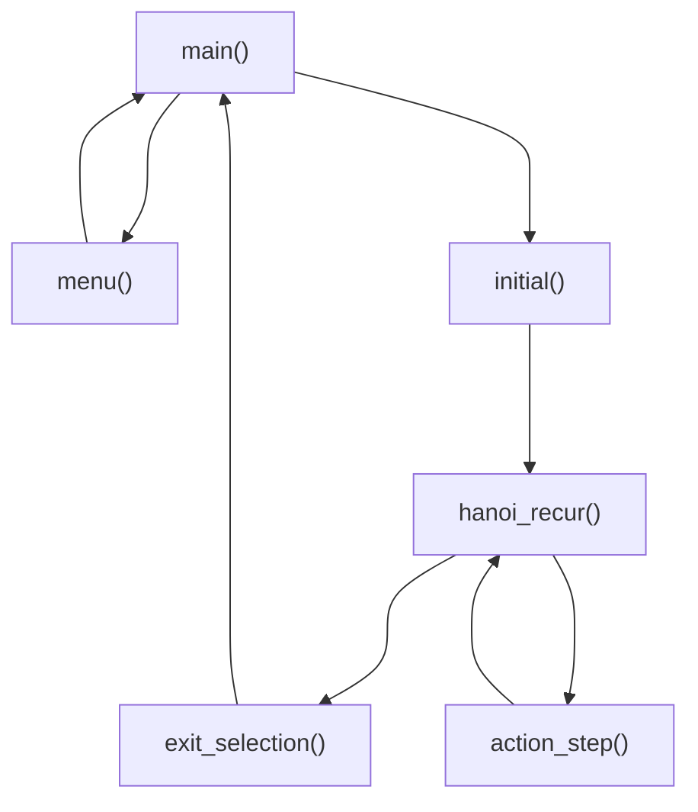
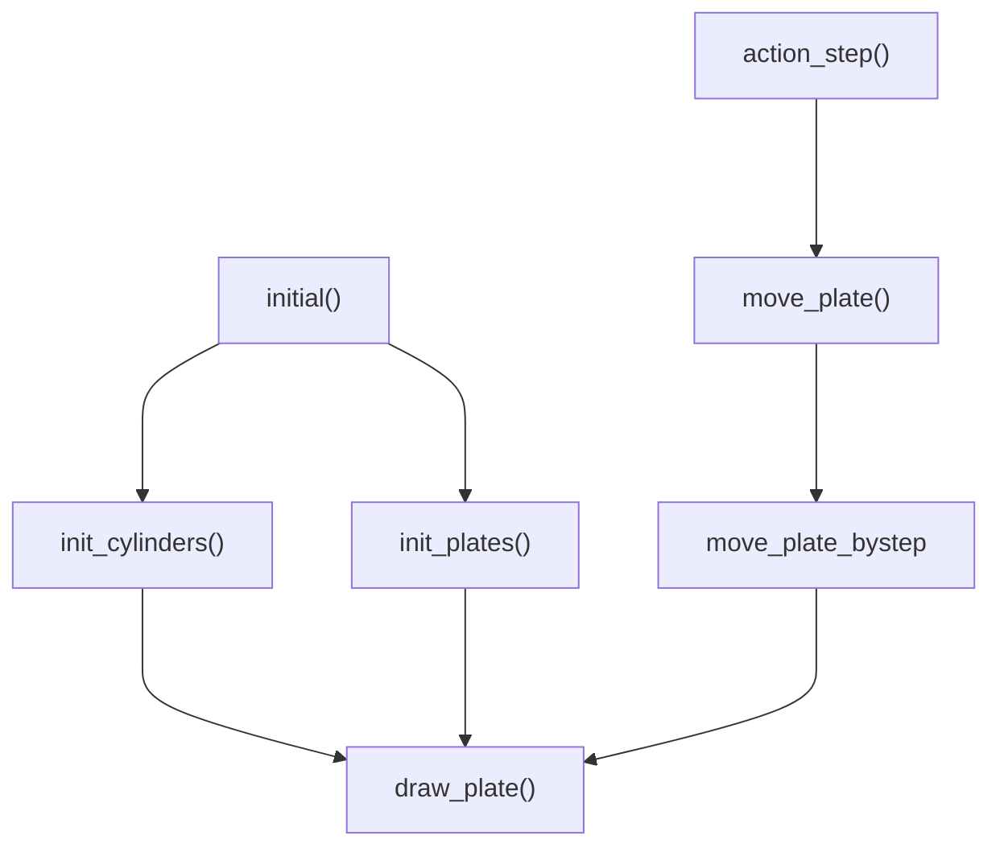
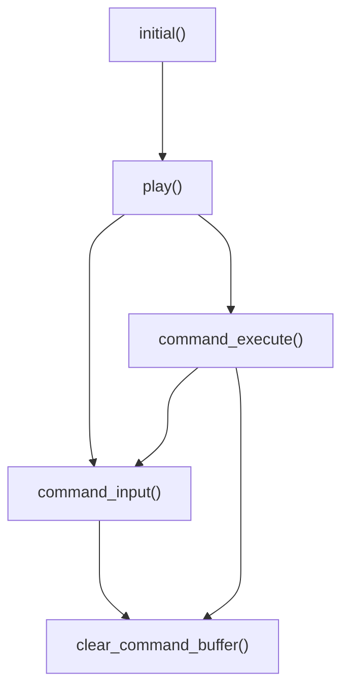
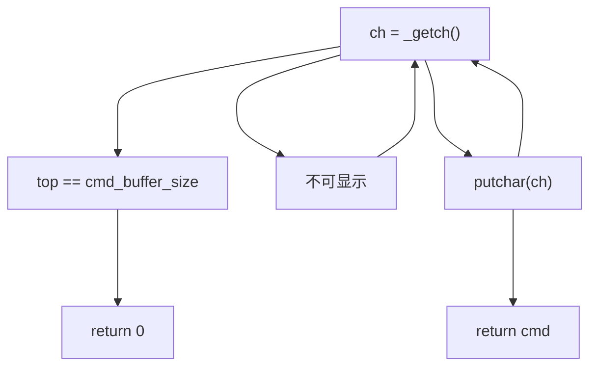

# 汉诺塔伪图形界面实现

## 题目及基本要求描述

在终端上利用多种方法模拟汉诺塔的解法。

汉诺塔（Hanoi Tower）是一种游戏，需要玩家将三根柱子中的某一摞叠放好的圆盘移动到另一根柱子上。其规则是：

1. 每次移动都只能将一个盘子从一根柱子上移动到另一根；
2. 任意时刻，必须保证小盘子在大盘子的上方。

要求利用计算机模拟汉诺塔的圆盘移动步骤，从简单到复杂给出了 5 种终端模拟方法：

1. 在终端打印每一次移动的圆盘序号，从哪个柱子移动到哪个柱子；
2. 在 1 的基础上，打印步骤的序号；
3. 在 2 的基础上，横向打印每一步移动以后，三根柱子上的圆盘的状态（分别有哪些圆盘）；
4. 在 3 的基础上，另外纵向打印每一步移动以后，三根柱子上的圆盘的状态；
8. 在 4 的基础上，另外在终端种用色块模拟真实的物理场景，将圆盘的移动做成终端演示动画。

除了模拟解法之外，还构建了人机交互的游戏模式

6. 展示终端演示动画，让用户输入指令移动圆盘

为了保证题目难度的连续性，在第 5 个模式前增加了一些辅助选项

5. 用色块显示 3 个圆柱
6. 用色块显示起始柱上的圆盘
7. 在上面两项的基础上，实现第一次移动动画

这些选项共同构成了选择菜单的 9 个选项。要求在终端界面显示选择菜单，键入对应字符以后跳转到对应的模式下开始演示或交互。

## 整体设计思路

题目可以分为两大类：

- 内置求解汉诺塔问题算法的选项 1~4, 8（5,6,7 作为 8 的辅助）
- 需要用户输入指令进行交互的选项 9

这里先阐述第一类选项的设计思路——递归与栈。

### 递归

汉诺塔的解法中，最简单、最易于理解的方法是递归：将各个圆盘从小到大依次从原来的位置移动到目标的位置。为了便于阐述，姑且将三根柱子命名为起始柱、中间柱、目标柱，将圆盘从小到大依次编号为 $1, 2, \cdots, n$.

那么移动第 $k(>1)$ 个圆盘的方法就是先将上面的 $k - 1$ 个圆盘从起始柱移动到中间柱，将第 $k$ 个圆盘一步从起始柱移动到目标柱，再将上面的 $k - 1$ 个圆盘移动从中间柱到目标柱。用 C++ 代码可以这样表示所述的算法：

```cpp
void hanoi_recur(int n, char src, char tmp, char dst, int selection)
{
    if (n == 1)
    {
        action_step(n, src, dst, selection);
        return;
    }
    else
    {
        hanoi_recur(n - 1, src, dst, tmp, selection);
        action_step(n, src, dst, selection);
        hanoi_recur(n - 1, tmp, src, dst, selection);
    }
}
```

其中 ``action_step`` 表示的是每一步的操作函数，具体的操作方法由目前的圆盘序号，对于这个圆盘的起始柱和目标柱以及菜单的选项而定，需要另行定义。

### 栈

各种选项对应不同的函数 ``action_step``，对于选项 1 和 2，只需要简单地打印每一步的信息就可以了，对于后面的选项 3、4 和 8，则需要一个存储数据结构来储存移动过程中的中间信息。

观察汉诺塔的圆盘移动，发现每一个柱子上圆盘的序号满足“先进后出”（FILO）的规则。因此我们构造一个全局的栈来实现这个功能。

```cpp
static int tops[3] = {0};
static int state[3][MAXSIZE] = {0};
```

其中，静态全局数组 ``tops[3]`` 代表三个柱子对应栈的栈顶指针，用静态全局二维数组 ``states[3][MAXSIZE]`` 存储三个栈中的内容。

在程序执行的过程中，需要对栈进行初始化，入栈出栈和清空。对应整个程序的框架也与之相符。



在选项 9 的用户指令识别模块，也用到了类似的栈来储存用户输入的字符。

## 主要功能实现

程序中较为复杂的功能实现有：

- 纵向打印数字，显示柱的状态
- 利用色块显示柱和圆盘，并且能够实现圆盘的移动
- 在选项 9 中，能够读取用户输入的指令，判断指令的合法性，并移动对应的圆盘

### 纵向打印数字

纵向打印数字的核心就是利用提供的库函数 ``cct_gotoxy()`` 将光标移动到指定的位置，输出对应的栈中的数字。

这里定义了两个函数，一个用于初始化打印，另一个用于圆盘移动过程的打印。

```cpp
void init_col_print(int n, char src, int selection);
void move_col_print(char src, char dst, int selection);
```

其中要避免出现显式的数字作为光标坐标，否则在调整打印位置的时候，代码的迁移性不好。

### 色块显示与移动

实现在某一个位置显示色块，需要利用库函数 ``cct_gotoxy()`` 和 ``cct_showch()``。将光标移动到一个位置，设置背景色为某个指定颜色，在对应的位置打印空格即可。这里利用这个原理对相应的功能做了封装。



其中

- ``draw_plate`` 实现了画圆盘和擦圆盘两种过程的一体化，代码更抽象
- ``init`` 的两个函数和纵向打印数字的函数的方法大致相同，将数字改成色块即可
- ``move_plate_bystep`` 的实现方法是擦掉原来的位置上的色块，在新位置画上色块，调用一次移动一格
- ``move_plate`` 函数实现了一个圆盘的柱间移动

### 用户指令识别

函数调用关系如图所示



在通用的函数 ``initial()`` 中调用新定义的函数 ``play()`` 循环地读取用户的指令、加以判断并执行。在这中又定义了单步指令输入函数 ``command_input()`` 和单步指令执行函数 ``command_execute()``。此外还定义了一个经常使用的函数 ``clear_command_buffer()``，用于清空某一块终端的显示。

需要特别说明的是，``command_input()`` 函数不同于普通的 ``cin`` 输入流，所有不可显示的字符都是无效的，甚至不会回显。因此这里组合利用了 ``_getch()`` 和 ``putchar()`` 函数，在不同的条件下可以实现和 demo 一致的效果。



## 调试问题

对于程序的结构比较良好的部分（选项 1-8），基本没有遇到什么值得记录的问题。因为我通过将细化的函数编写，分别独立的调试，基本都能得到预期的结果。

在编写圆盘单步移动函数 ``move_plate_bystep`` 的过程中，本来想就地捕捉被移动圆盘的颜色，以实现更好的通用性。但是我发现库函数 ``cct_getcolor`` 并不能达到预期的效果：捕捉光标位置的背景色和前景色。

于是我放弃使用这个库函数，转而将圆盘的颜色设置为和圆盘的大小一样的值，这可能会造成程序的自定义性、灵活性不强，但是对于此问题来说，可以减少很多个函数的参数传入，减少了用于捕捉终端窗口信息的底层代码，使得程序更简洁，减少了出错的概率。

另外一个比较严重的调试问题出现在选项 9，即用户交互模式。

## 心得体会

这次作业让我又一次想起了一句著名的代码哲学：

> 代码有很多种坏味道，重复是最坏的一种。

在之前的作业中，我已经体会到了函数式编程在代码编写中的好处：效率高、不易出错、调试简单、可读性强。在完成这次大作业的过程中，我将这一理念充分实现了，以至于在文件 hanoi_multiple_solutions.cpp 中函数的个数达到了惊人的 22 个。

我认为，不管题目的呈现形式到底是一道大题还是很多小题目的组合，我们自己都要学会实现功能的拆分。这是工程思维的体现，在计算机科学中尤其如此，要避免重复“造轮子”。因此在一开始，就要将轮子造的足够“结实”，足够通用。

甚至有时为了保证可读性，将一个语句写成函数都是值得鼓励的。函数的名称要符合它的功能，这样在被调用的时候，其含义将更加清晰。为了更好地重用代码，我习惯在每一个函数的开头写注释，著名函数的功能、函数输入输出参数的意义。这样在编辑器中调用这个函数的时候，可以在智能提示信息中看到函数的功能，提高了开发效率。

## 附录

源代码（由于篇幅限制，删去了一部分不重要的注释）

```cpp
// hanoi.h
#pragma once
#define MAXSIZE 10
int menu();
void initial(int n, char src, char tmp, char dst, int selection, int delay_mode);
void hanoi_recur(int n, char src, char tmp, char dst, int selection, int delay_mode);
void exit_selection(int selection);
void init_cylinders();
void get_n(int &n);
void get_src(char &src);
void get_dst(char src, char &dst);
void get_delay(int &delay_mode);
```

```cpp
// hanoi_menu.cpp
#include "hanoi.h"
#include <conio.h>
#include <iostream>
using namespace std;
/*print menu and return user's selection
- input: void
- output: int selection
    0: quit
    1: basic solution
    2: basic solution with step record
    3: with inner array printed in rows
    4: with inner array printed both in rows and in columns
    5: UI-prepare: print 3 cylinders
    6: UI-prepare: print n layers on source cylinder
    7: UI-prepare: first move
    8: UI auto-move
    9: UI game mode
*/
int menu()
{
    char selection = '\0';
    cout << "---------------------------------" << endl;
    cout << "1.基本解" << endl;
    cout << "2.基本解(步数记录)" << endl;
    cout << "3.内部数组显示(横向)" << endl;
    cout << "4.内部数组显示(纵向+横向)" << endl;
    cout << "5.图形解-预备-画三个圆柱" << endl;
    cout << "6.图形解-预备-在起始柱上画n个盘子" << endl;
    cout << "7.图形解-预备-第一次移动" << endl;
    cout << "8.图形解-自动移动版本" << endl;
    cout << "9.图形解-游戏版本" << endl;
    cout << "0.退出" << endl;
    cout << "---------------------------------" << endl;
    cout << "[请选择:]";
    while (!(selection >= '0' && selection <= '9'))
    {
        selection = _getch();
    }
    putchar(selection);
    cout << endl << endl;
    return selection - '0';
}
```

```cpp
// hanoi_main.cpp
#include "cmd_console_tools.h"
#include "hanoi.h"
#include <iostream>
using namespace std;
int main()
{
    int n, selection, delay_mode = 0;
    char src, tmp, dst;
    /* demo中首先执行此句，将cmd窗口设置为40行x120列（缓冲区宽度120列，行数9000行，即cmd窗口右侧带有垂直滚动杆）*/
    cct_setconsoleborder(120, 40, 120, 9000);
    while (1)
    {
        cct_cls();
        selection = menu();
        if (selection == 5)
        {
            cct_cls();
            init_cylinders();
            exit_selection(selection);
            continue;
        }
        if (selection == 0)
            return 0;
        get_n(n);
        get_src(src);
        get_dst(src, dst);
        tmp = 'A' + 'B' + 'C' - src - dst;
        if (selection == 4 || selection == 8)
            get_delay(delay_mode);
        switch (selection)
        {
            case 1:
            case 2:
            case 3:
            case 4:
            case 8:
                initial(n, src, tmp, dst, selection, delay_mode);
                hanoi_recur(n, src, tmp, dst, selection, delay_mode);
                exit_selection(selection);
                break;
            case 6:
            case 7:
            case 9:
                initial(n, src, tmp, dst, selection, delay_mode);
                exit_selection(selection);
                break;
        }
    }
    return 0;
}
```

```cpp
#include <conio.h>
#include <iomanip>
#include "hanoi.h"
#include "cmd_console_tools.h"
#include <iostream>
#include <windows.h>
using namespace std;
/* macros in menu4 */
#define y_bottom 11
#define y_info 19

/* macros in menu5,6 */
#define CLR_CYLINDERS COLOR_HYELLOW
#define y_delta 15
#define y_uplimit 2
#define y_pedestal 15
#define y_exit 30
#define height_cylinder 12
#define width_half_pedestal 11
#define width_interval 32

/* macros in menu 9 */
#define cmd_buffer_size 19
#define x_cmd 60
#define y_cmd y_info + y_delta + 4

/* global variables */
static unsigned int cnt = 1;
static int tops[3] = {0};
static int state[3][MAXSIZE] = {0};

/* functions for menu3
init_stack
print_row_stack
init_state
move_state
print_row_state
*/

/*Initialize the stack by giving top ptr
- input:
    int top
    int stack[]
*/
void init_stack(int top, int stack[])
{
    int i = 0;
    while (top > 0)
    {
        stack[i] = top;
        ++i;
        --top;
    }
}

/*print stack in a row
- input:
    int stack[]
    int top
*/
void print_row_stack(int stack[], int top)
{
    int i = 0;
    while (top > 0)
    {
        cout << setw(2) << stack[i];
        --top;
        ++i;
    }
    while (i < MAXSIZE)
    {
        cout << "  ";
        ++i;
    }
}

/*Initialize the state
- input:
    int n: number of layers
    char src: source stack
- calling:
    init_stack()
*/
void init_state(int n, char src)
{
    init_stack(n, state[src - 'A']);
    tops[src - 'A'] = n;
}

/*Move state of 3 stacks
- input:
    char src: source stack
    char dst: destination stack
*/
void move_state(char src, char dst)
{
    state[dst - 'A'][tops[dst - 'A']++] = state[src - 'A'][--tops[src - 'A']];
}

/*print state of 3 stacks in a row
 */
void print_row_state()
{
    cout << " A:";
    print_row_stack(state[0], tops[0]);
    cout << " B:";
    print_row_stack(state[1], tops[1]);
    cout << " C:";
    print_row_stack(state[2], tops[2]);
    cout << endl;
}

/* functions for menu4
init_col_print
move_col_print
wait
*/

/*Print initial information
- input:
    int n: number of layers
    char src: source stack
*/
void init_col_print(int n, char src, int selection)
{
    const int x_ABC[3] = {10, 20, 30};
    for (int i = 0; i < MAXSIZE + (selection == 8 ? y_delta : 0); ++i)
        cout << endl;
    cout << endl;
    cout << "         =========================" << endl;
    cout << "           A         B         C" << endl;
    cout << endl
         << endl
         << endl
         << endl
         << endl;
    if (1) // ??
    {
        cout << "初始:               ";
        print_row_state();
    }
    for (int i = 0; i < n; ++i)
    {
        cct_gotoxy(x_ABC[src - 'A'], y_bottom - i + (selection == 8 ? y_delta : 0));
        cout << setw(2) << n - i;
    }
}

/*Change print info when moving
- input:
    char src: source stack
    char dst: destination stack
*/
void move_col_print(char src, char dst, int selection)
{
    const int x_ABC[3] = {10, 20, 30};
    cct_gotoxy(x_ABC[src - 'A'], y_bottom - tops[src - 'A'] + (selection == 8 ? y_delta : 0));
    cout << "  ";
    cct_gotoxy(x_ABC[dst - 'A'], y_bottom - tops[dst - 'A'] + 1 + (selection == 8 ? y_delta : 0));
    cout << setw(2) << state[dst - 'A'][tops[dst - 'A'] - 1];
}

/*Wait certain time according to mode input
- int delay_mode: delay mode (0-5)
*/
void wait(int delay_mode)
{
    char ch = '0';
    int delay;
    if (delay_mode)
    {
        switch (delay_mode)
        {
            case 1:
                delay = 500;
                break;
            case 2:
                delay = 100;
                break;
            case 3:
                delay = 50;
                break;
            case 4:
                delay = 10;
                break;
            case 5:
                delay = 5;
                break;
            default:
                break;
        }
        Sleep(delay);
    }
    else
    {
        while (ch != '\r') // [RETURN]: 13
            ch = _getch();
    }
}

/* functions for menu5, 6, 7, 8
init_cylinders
draw_plate
init_plates
move_plate_bystep
move_plate
*/

/* initialize the 3 cylinders
*/
void init_cylinders()
{
    for (int j = 0; j < 3; ++j)
    {
        cct_showch(j * width_interval, y_pedestal, ' ', CLR_CYLINDERS, 7, 2 * width_half_pedestal + 1);
        cct_setcolor();
        wait(5);
        for (int i = 0; i < width_interval - 2 * width_half_pedestal - 1; ++i)
            putchar(' ');
    }
    for (int i = 0; i < height_cylinder; ++i)
    {
        for (int j = 0; j < 3; ++j)
        {
            cct_showch(width_half_pedestal + j * width_interval, y_pedestal - i - 1, ' ', CLR_CYLINDERS, 7, 1);
            wait(5);
        }
    }
    cct_setcolor();
    cct_gotoxy(0, 0);
}

/* draw or erase a plate
- input:
    int x, y: coordinates
    int act: 1 for draw, 0 for erase
    int size: width = 2 * size + 1, color = size
    int state: 1 for plate on the cylinder, 0 for not, 0 by default
*/
void draw_plate(int x, int y, int act, int size, int state = 0)
{
    if (act)
    {
        cct_showch(x - size, y, ' ', size, 7, 2 * size + 1);
        cct_setcolor();
    }
    else
    {
        if (state)
        {
            cct_showch(x - size, y, ' ', 0, 7, size);
            cct_showch(x, y, ' ', CLR_CYLINDERS, 7, 1);
            cct_showch(x + 1, y, ' ', 0, 7, size);
        }
        else
            cct_showch(x - size, y, ' ', 0, 7, 2 * size + 1);
        cct_setcolor();
    }
}

/* initialize the plates on source cylinder
- input:
    int n: number of layers
    char src: source cylinder
*/
void init_plates(int n, char src)
{
    int coor_x = (int)(src - 'A') * width_interval + width_half_pedestal;
    int coor_y = y_pedestal;
    for (int i = 0; i < n; ++i)
    {
        --coor_y;
        draw_plate(coor_x, coor_y, 1, n - i, 1);
        wait(5);
    }
}

/* functions for menu7 & menu8
move_plate_bystep
move_plate
*/
void move_plate_bystep(int x, int y, char direction, int size, int state = 0)
{
    draw_plate(x, y, 0, size, state);
    switch (direction)
    {
        case 'u':
            draw_plate(x, --y, 1, size, state);
            break;
        case 'd':
            draw_plate(x, ++y, 1, size, state);
            break;
        case 'l':
            draw_plate(--x, y, 1, size, state);
            break;
        case 'r':
            draw_plate(++x, y, 1, size, state);
            break;
    }
}

/* move plate from src to dst
- input:
    char src    
    char dst
    int delay_mode: 0-5
*/
void move_plate(char src, char dst, int delay_mode)
{
    const int size = state[src - 'A'][tops[src - 'A'] - 1];
    int translation = (int)(dst - src) * width_interval;
    int coor_x = (int)(src - 'A') * width_interval + width_half_pedestal;
    int coor_y = y_pedestal - tops[src - 'A'];
    if (delay_mode == 0)
        delay_mode = 1;
    while (coor_y > y_uplimit)
    {
        move_plate_bystep(coor_x, coor_y, 'u', size, (coor_y >= y_pedestal - height_cylinder));
        --coor_y;
        wait(delay_mode);
    }
    if (translation > 0)
    {
        for (int i = 0; i < translation; ++i)
        {
            move_plate_bystep(coor_x, coor_y, 'r', size, 0);
            ++coor_x;
            wait(delay_mode);
        }
    }
    else
    {
        for (int i = 0; i < -translation; ++i)
        {
            move_plate_bystep(coor_x, coor_y, 'l', size, 0);
            --coor_x;
            wait(delay_mode);
        }
    }
    while (coor_y < y_pedestal - tops[dst - 'A'] - 1)
    {
        move_plate_bystep(coor_x, coor_y, 'd', size, (coor_y >= y_pedestal - height_cylinder));
        ++coor_y;
        wait(delay_mode);
    }
    cct_gotoxy(0, y_info + y_delta);
}

/* functions for menu9
clear_cmd_buffer
command_input
command_execute
is_end
play
*/

void clear_cmd_buffer(int len)
{
    for (int i = 0; i < len; ++i)
        putchar(' ');
    cct_gotoxy(x_cmd, y_cmd);
}

/* input legal command
- output:
    int command: ternary number, src & dst
        -1: Q
        00(0): invalid
        01(1): A -> B
        02(2): A -> C
        10(3): B -> A
        12(5): B -> C
        20(6): C -> A
        21(7): C -> B
*/
int command_input()
{
    char ch = '\0';
    int top = 0;
    char str[cmd_buffer_size] = { 0 };
    while (ch != '\r')
    {
        if (ch <= 32 || ch >= 127)
        {
            ch = _getch();
            continue;
        }
        if (top == cmd_buffer_size)
        {
            cct_gotoxy(x_cmd, y_cmd);
            clear_cmd_buffer(cmd_buffer_size);
            return 0;
        }
        putchar(ch);
        str[top++] = ch;
        ch = _getch();
    }
    if (top == 2)
    {
        if (str[0] >= 'A' && str[0] <= 'C' || str[0] >= 'a' && str[0] <= 'c')
        {
            str[0] += (str[0] >= 'a' && str[0] <= 'c') ? 'A' - 'a' : 0;
            if (str[1] >= 'A' && str[1] <= 'C' || str[1] >= 'a' && str[1] <= 'c')
            {
                str[1] += (str[1] >= 'a' && str[1] <= 'c') ? 'A' - 'a' : 0;
                if (str[1] != str[0])
                    return (int)(str[0] - 'A') * 3 + (int)(str[1] - 'A');
            }
        }
    }
    else if (top == 1)
    {
        if (str[0] == 'Q' || str[0] == 'q')
        {
            return -1;
        }
    }
    cct_gotoxy(x_cmd, y_cmd);
    clear_cmd_buffer(cmd_buffer_size);
    return 0;
}

int command_execute(int command)
{
    char src = 'A' + (char)(command / 3);
    char dst = 'A' + (char)(command % 3);
    if (tops[src - 'A'] == 0)
    {
        cout << endl
             << "源柱为空!";
        for (int i = 0; i < 4; ++i)
            wait(1);
        cct_gotoxy(0, y_cmd + 1);
        clear_cmd_buffer(cmd_buffer_size);
        clear_cmd_buffer(cmd_buffer_size);
        return 0;
    }
    if (tops[dst - 'A'] >= 1 && state[src - 'A'][tops[src - 'A'] - 1] > state[dst - 'A'][tops[dst - 'A'] - 1])
    {
        cout << endl
             << "大盘压小盘，非法移动!";
        for (int i = 0; i < 4; ++i)
            wait(1);
        cct_gotoxy(0, y_cmd + 1);
        clear_cmd_buffer(cmd_buffer_size * 2);
        clear_cmd_buffer(cmd_buffer_size);
        return 0;
    }
    move_plate(src, dst, 3);
    cout << "第" << setw(4) << cnt << " 步(" << setw(2)
         << state[src - 'A'][tops[src - 'A'] - 1] << "): "
         << src << "-->" << dst;
    move_state(src, dst);
    print_row_state();
    move_col_print(src, dst, 8);
    cct_gotoxy(x_cmd, y_cmd);
    clear_cmd_buffer(cmd_buffer_size);
    ++cnt;
    return 1;
}

int is_end(int n, char dst)
{
    return (tops[dst - 'A'] == n);
}

void play(int n, char dst)
{
    int cmd = 0;
    cct_gotoxy(0, y_cmd);
    cout << "请输入移动的柱号(命令形式：AC=A顶端的盘子移动到C，Q=退出) ：";
    while (!is_end(n, dst))
    {
        cmd = 0;
        cct_gotoxy(x_cmd, y_cmd);
        while (0 == cmd)
        {
            cmd = command_input();
            if (cmd == -1)
            {
                cout << endl
                     << "游戏中止！！！！！";
                return;
            }
        }
        command_execute(cmd);
    }
    cout << endl
         << "游戏结束！！！！！";
}

/* recursion function and its subsidary
action_step
hanoi_recur
*/

/*action of each step in recursion
- input:
    int n: number of layers
    char src: source cylinder (A/a, B/b, C/c)
    char dst: destination cylinder (A/a, B/b, C/c)
    int selection: selection in menu (1-4, 8)
    int delay_mode: delay mode in wait()
*/
void action_step(int n, char src, char dst, int selection, int delay_mode)
{
    switch (selection)
    {
        case 1:
            cout << setw(2) << n << "# " << src << "-->" << dst << endl;
            break;
        case 2:
            cout << setw(5) << cnt << ": " << setw(2) << n << "# "
                 << src << "-->" << dst << endl;
            break;
        case 3:
            move_state(src, dst);
            cout << "第" << setw(4) << cnt << " 步(" << setw(2) << n << "): "
                 << src << "-->" << dst;
            print_row_state();
            break;
        case 4:
            cct_gotoxy(0, y_info);
            wait(delay_mode);
            cout << "第" << setw(4) << cnt << " 步(" << setw(2) << n << "): "
                 << src << "-->" << dst;
            move_state(src, dst);
            print_row_state();
            move_col_print(src, dst, selection);
            cct_gotoxy(0, y_info + 4);
            break;
        case 8:
            wait(delay_mode);
            move_plate(src, dst, delay_mode);
            move_state(src, dst);
            cout << "第" << setw(4) << cnt << " 步(" << setw(2) << n << "): "
                 << src << "-->" << dst;
            print_row_state();
            move_col_print(src, dst, selection);
            cct_gotoxy(0, y_info + y_delta + 4);
            break;
        default:
            break;
    }
    ++cnt;
}

/*hanoi recursion function
- call:
    action_step(): action each step according to selection
    static var: counter
- input:
    int n: number of layers
    char src: source cylinder (A/a, B/b, C/c)
    char tmp: temporary cylinder (A/a, B/b, C/c)
    char dst: destination cylinder (A/a, B/b, C/c)
    int selection: selection in menu (1-4, 8)
    int delay_mode: delay mode in wait()
*/
void hanoi_recur(int n, char src, char tmp, char dst, int selection, int delay_mode)
{
    if (n == 1)
    {
        action_step(n, src, dst, selection, delay_mode);
        return;
    }
    else
    {
        hanoi_recur(n - 1, src, dst, tmp, selection, delay_mode);
        action_step(n, src, dst, selection, delay_mode);
        hanoi_recur(n - 1, tmp, src, dst, selection, delay_mode);
    }
}

/* basic function called in hanoi_main.cpp
initial
exit_selection
*/

/*initial print
- input:
    int selection: selection in menu (1-9)
*/
void initial(int n, char src, char tmp, char dst, int selection, int delay_mode)
{
    switch (selection)
    {
        case 3:
            init_state(n, src);
            cout << "初始:               ";
            print_row_state();
            break;
        case 4:
            cct_cls();
            cout << "从 " << src << " 移动到 " << dst << "，共 " << n << " 层，";
            cout << "延时设置为 " << delay_mode << endl;
            init_state(n, src);
            init_col_print(n, src, 4);
            break;
        case 6:
            cct_cls();
            init_cylinders();
            init_state(n, src);
            init_plates(n, src);
            break;
        case 7:
            cct_cls();
            init_cylinders();
            init_state(n, src);
            cout << "从 " << src << " 移动到 " << dst << "，共 " << n << " 层，";
            init_plates(n, src);
            wait(1);
            move_plate(src, (n % 2 ? dst : tmp), delay_mode);
            cct_gotoxy(0, y_info + y_delta + 4);
            break;
        case 8:
            cct_cls();
            init_state(n, src);
            init_cylinders();
            cout << "从 " << src << " 移动到 " << dst << "，共 " << n << " 层，";
            cout << "延时设置为 " << delay_mode << endl;
            init_col_print(n, src, 8);
            init_plates(n, src);
            wait(1);
            break;
        case 9:
            cct_cls();
            init_state(n, src);
            init_cylinders();
            cout << "从 " << src << " 移动到 " << dst << "，共 " << n << " 层" << endl;
            init_col_print(n, src, 8);
            init_plates(n, src);
            play(n, dst);
            cout << endl
                 << endl
                 << endl;
            break;
        default:
            break;
    };
}

/*exit the part of selection
- input:
    int selection: selection in menu (1-9)
*/
void exit_selection(int selection)
{
    cnt = 1;
    tops[0] = 0;
    tops[1] = 0;
    tops[2] = 0;
    if (selection > 4 && selection < 9)
        cct_gotoxy(0, y_exit + (selection == 8 ? y_delta : 0));
    cout << "按回车键继续";
    wait(0);
}

void get_n(int &n)
{
    while (1)
    {
        cout << "请输入汉诺塔的层数(1-" << MAXSIZE << ")" << endl;
        cin >> n;
        if (cin.fail())
            cin.clear();
        else if (n >= 1 && n <= MAXSIZE)
        {
            cin.ignore(32767, '\n');
            break;
        }
        cin.ignore(32767, '\n');
    }
}

void get_src(char &src)
{
    while (1)
    {
        cout << "请输入起始柱(A-C)" << endl;
        cin >> src;
        if (cin.fail())
            cin.clear();
        else if (src == 'A' || src == 'B' || src == 'C' || src == 'a' || src == 'b' || src == 'c')
        {
            if (src == 'a' || src == 'b' || src == 'c')
                src += 'A' - 'a';
            cin.ignore(32767, '\n');
            break;
        }
        cin.ignore(32767, '\n');
    }
}

void get_dst(char src, char &dst)
{
    while (1)
    {
        cout << "请输入目标柱(A-C)" << endl;
        cin >> dst;
        if (cin.fail())
            cin.clear();
        else if (dst == 'A' || dst == 'B' || dst == 'C' || dst == 'a' || dst == 'b' || dst == 'c')
        {
            if (dst == 'a' || dst == 'b' || dst == 'c')
                dst += 'A' - 'a';
            cin.ignore(32767, '\n');
            if (dst == src)
            {
                cout << "目标柱(" << src << ")不能与起始柱(" << src << ")相同" << endl;
                continue;
            }
            break;
        }
        cin.ignore(32767, '\n');
    }
}

void get_delay(int &delay_mode)
{
    while (1)
    {
        cout << "请输入移动速度(0-5: 0-按回车单步演示 1-延时最长 5-延时最短)" << endl;
        cin >> delay_mode;
        if (cin.fail())
            cin.clear();
        else if (delay_mode >= 0 && delay_mode <= 5)
            break;
        cin.ignore(32767, '\n');
    }
}
```
