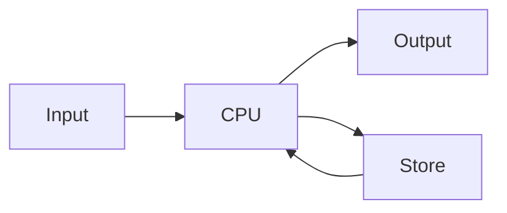
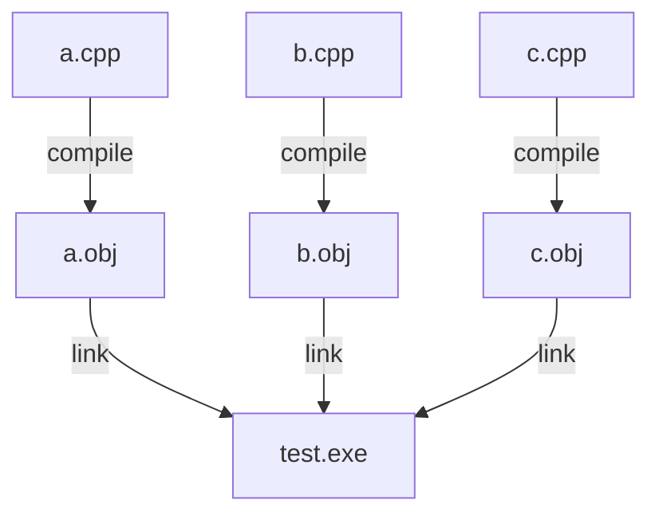

# 基础知识

---

## 2.1

如何组装计算机？

- CPU
- 主板
- 内存（读写在 ns 数量级）
- 硬盘（读写在 ms 数量级）
- 显卡+显示器
- 键盘鼠标
- 机箱电源
- 打印机等外接设备

---

冯诺依曼架构



程序：使 CPU(运算器和控制器) 工作的一串指令。

- Advanced Language
- Machine Language
- Assembly Language

---

Data Structure：编写程序时数据的组织方法。

Linear List vs. Linked LIst

Algorithm: how to make program run effectively.

To calculate $\pi$:

- Iteration
- Monte Carlo

Auto-driving:

- condition recognition
- learn from the old driver

---

Principle of Compile: how to convert advance lang to machine lang.

OS: manage and arange computer resources.

Computer Organization

Network: change data

Sercurity: protect data

Mode Recognition & AI: service

---

Dataset System: combine quantity of data of different types.

Big Data Tech: attain useful information from huge data.

数据库（事务性） vs 数据仓库（分析历史）

数据仓库不要求数据历史长，但要求**大致的准确性**。

---

## 2.2

---

Binary System

bit(b) & byte(B): 1 byte = 8 bit

| KB | MB | GB | TB |
| -- | -- | -- | -- |
| $2^{10}$ | $2^{20}$ | $2^{30}$ | $2^{40}$ |

除了硬盘，U 盘，其他的计算机系统：$1K = 2^{10}$

---

Data Presentation: Binary

- numerals(tel, ...)
- value
- text(encoding system)
- Picture(RGB)
- Video(fps)
- Voice(sample, $\Delta t \rightarrow 0$)
    - audio: 8kHz
    - music: 40kHz

---

## 2.3

---

Introduction to CPP

```c++
#include <iostream> // input-output stream
using namespace std; // standard
int main() // function
{
    int a, b, sum;
    cin >> a >> b; // input
    sum = a + b;
    cout << "a+b=" << sum << endl; // output
    return 0;
}
```

---

basic form:

- head file
- namespace
- constant def
- func def
- global var def
- func 1
- ...
- func n

---

Function is unit of a cpp program.


---



---

- Only one ``main()`` (where the program launches from)
- Funcs from Packages.

---

Component of func:

- return type
- name of func
- formal parameter list
- body of func

- Paralleled definition
- Nested calling

---

Statement is the unit of funcs.

- **End with ;**
- Continue with \ (or default)

- define statement
- execute statement

***Suggestion: One Row One Statement***

Annotation: ``/* */`` ``//``

---

## 2.4

Types

---

Data Types

- Basic Types
    - int (signed and unsigned)
        - short int
        - int
        - long int
        - long long int
    - char (signed and unsigned)
    - float
        - float
        - double
        - long double
    - bool
- Derivate Types
    - pointer
    - enum
    - array
    - struct
    - union
    - class
- Void

---

Based on VS2022 x86

| Types        | bytes |
| ------------ | ----- |
| [signed] int | 4     |
| unsigned int | 4     |

``sizeof(int)``

Different Compiler, Different OS, some differences in bytes of types.

---

Attain min and max values for head file climits.

```c++
#include <iostream>
#include <climits>
using namespace std;
int main()
{
    cout << INT_MIN << endl;
    cout << UINT_MIN << endl;
    cout << LLONG_MAX << endl;
    return 0;
}
```

---

The computer can not use binary system to denote infinity. But infinity can be defined especially.

---

How to denote positive/negative integer in binary system?

Based on short type:

``unsigned short``: 0000 0000 0000 0001 (+1)

``signed short``: 0111 1111 1111 1111 (32767)

bit of sign on the left

- true form (0000 0000 0000 0000 = 1000 0000 0000 0000) **two different codes of 0**
- complement (-x: (not x) + 1)

---

## 2.5

Constant

---

- 字面常量
- 符号常量

---

Constant Value

- Bin: 0b[0-1]
- Dec: [0-9]
- Oct: 0[0-9] (***0123***)
- Hex: 0x[0-9a-f]

---

Decimal is outputed by ``cout`` by default.

``cout << "0x" << hex << 119 << endl;`` --->  ``0x77``

注意区分：

- 内部表示
- 输出显示
- 额外修饰

---

- signed int: 123
- signed long: 123L
- unsigned int: 123U
- unsigned long: 123UL, 123LU

``cout << typeid(123U).name() << endl;`` --->  ``unsigned int``

---

float

- 小数形式
- 指数形式 (float + [e,E] + int)

机内存储：小数点之前为 0，小数点之后第一位不为 0 的指数形式。($0.23 \times 10^{7}$)

这样可以把浮点数存储为两个正数（小数点之后的部分和指数）

---

Physic Storage of Float

31: sign bit
30~23: exponent
22~0: 尾数


---

- double: 1.23
- float: 1.23F

``sizeof()`` ``typeid().name``

---


IEEE 754