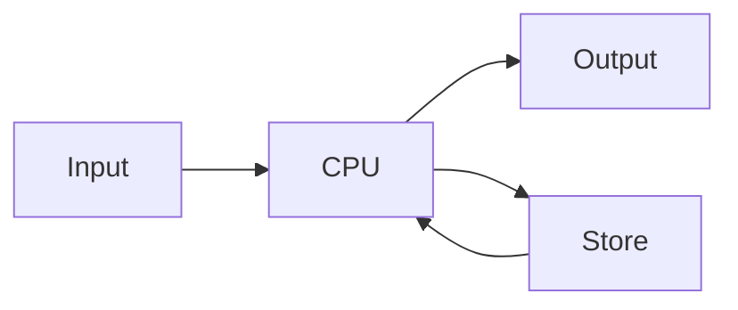

# 基础知识

---

## 2.1

如何组装计算机？

- CPU
- 主板
- 内存（读写在 ns 数量级）
- 硬盘（读写在 ms 数量级）
- 显卡+显示器
- 键盘鼠标
- 机箱电源
- 打印机等外接设备

---

冯诺依曼架构

程序：使 CPU(运算器和控制器) 工作的一串指令。

- Advanced Language
- Machine Language
- Assembly Language

---

Data Structure：编写程序时数据的组织方法。

Linear List vs. Linked LIst

Algorithm: how to make program run effectively.

To calculate $\pi$:

- Iteration
- Monte Carlo

Auto-driving:

- condition recognition
- learn from the old driver

---

Principle of Compile: how to convert advance lang to machine lang.

OS: manage and arange computer resources.

Computer Organization

Network: change data

Sercurity: protect data

Mode Recognition & AI: service

---

Dataset System: combine quantity of data of different types.

Big Data Tech: attain useful information from huge data.

数据库（事务性） vs 数据仓库（分析历史）

数据仓库不要求数据历史长，但要求**大致的准确性**。

---

Binary System

bit(b) & byte(B): 1 byte = 8 bit

| KB | MB | GB | TB |
| -- | -- | -- | -- |
| $2^{10}$ | $2^{20}$ | $2^{30}$ | $2^{40}$ |

除了硬盘，U 盘，其他的计算机系统：$1K = 2^{10}$

---

Data Presentation: Binary

- numerals(tel, ...)
- value
- text(encoding system)
- Picture(RGB)
- Video(fps)
- Voice(sample, $\Delta t \rightarrow 0$)
    - audio: 8kHz
    - music: 40kHz
