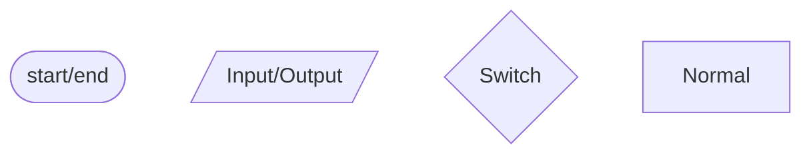

# Structure

---

## 3.1

Algorithm

---

计算机算法：指令的有限序列。

- 数值算法：大数据量计算，但逻辑相对简单
- 非数值算法：大数据量管理，逻辑相对复杂但计算比较简单

---

算法的基本特征

- 输入 Input 0-n
- 输出 Output 1-n
- 确定性 Certainty: Same Input ---> Same Output
- 有穷性 Limited **Steps** and **Time**
- 有效性 By definite steps of realized elementary operations

---

程序

- 数据的描述（数据结构）：在程序中指定的数据类型和组织方式
- 操作的描述（算法）：对动作的描述

程序的结构

- 顺序
- 分支
- 循环

条件

- 单入单出
- 每一部分**都可以**被执行
- 不存在死循环

---

流程图表示程序



---

两种循环

- 当型循环
- 直到型循环（至少执行一次）

---

## 3.2

cpp program

---

- ``*.h``
- ``*.cpp``
    - 预处理指令
    - 全局声明
    - 若干函数
        - 声明语句：Define a Variable
        - 执行语句
            - 控制语句
                - ``if else``
                - ``switch case``
                - ``break``
                - ``goto``
                - ``for``
                - ``while``
                - ``do while``
                - ``continue``
                - ``return``
            - 函数和流对象调用语句
                - ``max(a,b);``
                - ``std::cout << x << std::endl;``
            - 表达式语句 ``;``
                - 算术表达式
                - 赋值表达式
                - 逗号表达式
        - 空语句：``;``
        - 复合语句：``{ ... }``

---

## 3.3

语句和表达式的区别

---

```cpp
#include <iostream>
using namespace std;
int main()
{
    int a;
    (a=3)*10; // get 30(left val)
    (a=3;)*10; // ERROR!
    return 0;
}
/*
warning: "*"
error: syntax error: ";"
error: syntax error: ")"
error: 非法间接寻址
*/
```

---

## 3.4

Input/Output in C++

---

流：来自设备或传给设备的一个数据流，由一系列字节组成，按顺序排列。

C/CPP 原生标准没有输入输出

```c
#include <stdio.h>
// scanf(), printf()
```

```cpp
#include <iostream>
// std::cin >> 流提取
// std::cout << 流插入
```

---

```cpp
cout << sta1 << sta2 << sta3 << endl;
```

插入的数据存储在缓冲区中，在下面三种情况输出：

1. 缓冲区满
2. 遇到换行符 ``'\n', std::endl`` （在 Windows OS 不被严格执行，在 Linux OS 中被严格执行）
3. 强制输出 ``cout.flush()``

```cpp
#include <iostream>
#include <Windows.h>
//Sleep()
int main()
{
    std::cout << "12345";
    Sleep(1000*5); // ms
    std::cout << "abcde" << std::endl;
    return 0;
}
```

```cpp
#include <iostream>
#include <unistd.h>
//sleep()
int main()
{
    std::cout << "12345"; // << endl;
    // cout.flush(); // 只有添加了两条注释中的一条，才会在 5 秒之前输出。
    sleep(5); // s
    std::cout << "abcde" << std::endl;
    return 0;
}
```

---

输出重定向

---

流提取和流输出运算符的优先级为 7，高于逗号表达式的 18.

```cpp
#include <iostream>
using namespace std;
int main()
{
    int a=10, b=15, c=20;
    cout << a, b, c; // Output: 10 逗号表达式
    cout << (a,b,c); // Output: 20
    cout << a,b,c << endl; // ERROR
    return 0;
}
```

---

输出流自动识别变量类型

```cpp
#include <iostream>
using namespace std;
int main()
{
    char a = 65;
    cout << a+0 << endl; // Output: 65 type conversion
    return 0;
}
```

---

输入流

``cin >> var1 >> var2 >> var3;

``cin >> (a,b,c);`` is OK.

输入的终止条件：空格，换行，非法输入。根据==最长原则==读取合理的数据。

可以判断是否成功输入，返回 ``bool``.

```cpp
cin.good();
cin.fail();
/*
一般来说两个语句结果互斥
在文件读写的时候可能出现都为 0 的情况
*/
```

当 ``cin.good()==1`` 或 ``cin.fail()==0`` 时，变量的值不可信，不讨论。

---

```cpp
#include <iostream>
using namespace std;
int main()
{
    unsigned short k;
    cin >> k;
    cout << "k=" << k << endl;
    cout << "good=" << cin.good() << endl;
    cout << "fail=" << cin.fail() << endl;
}
```

```shell
$ ./a.out
65535
k= 65535
cin.good() = 1
$ ./a.out
65536
k= 65535
cin.good() = 0
$ ./a.out
-1
k= 65535
cin.good() = 1
$ ./a.out
-65535
k= 1
cin.good() = 1
$ ./a.out
-65536
k= 65535
cin.good() = 0
```

不超过 ``unsigned short`` 的上下限，就正确，超过就错误。

---

输入和赋值的区别：

同样超数据范围，两种语句的处理不同。

- ``cin``：``good()`` 为 0，结果不可信
- 赋值：截断

如果输入 ``float`` 超范围，则 ``cin.good()==0``.

---

格式化控制符

```cpp
#include <iostream>
#include <iomanip>
using namespace std;
int main()
{
    int b = 123456;
    cout << b << endl;
    cout << hex << b << endl; // 1e240
    cout << setiosflags(ios::uppercase) << b << endl; // keep hex! 1E240
    cout << dec;
    cout << setw(10) << b << ',' << b << endl; // valid for just one time
    cout << setfill('*') << setw(10) << b << endl; // ' ' by default
    cout << setfill('*') << setw(10) << setiosflags(ios::left) << b << endl; // ' ' by default
    cout << setiosflags(ios::showpos) << b << endl; // show positive

    double a = 123.456789012345;
    cout << setprecision(9) << a << endl; // 默认是有效数字位数
    cout << setprecision(6);
    cout << setiosflags(ios::fixed) << a << endl; // 修改成小数点后位数

    return 0;
}
```

---

``cin`` 成员函数

---

文件结束符：表示文件结束的特殊标记

一般使用 ``CTRL + Z`` 表示键盘输入文件结束符

文件结束标记：判断文件是否结束的特殊标记，用宏定义 ``EOF`` (End of File) 来表示

- 不同的系统 ``EOF`` 的值可能不同。
- 一般只用于字符输入流的判断。

---

简单的 ``cin >> ch`` 只能读取非空白字符，不能读取空格和换行等，但是 ``cin.get()`` 可以

- ``cin.get()`` 从输入流中读取一个字符并返回
- ``cin.get(char ch)`` 从输入流中读取一个字符给 ``ch``，返回流对象自身 ``cin``
- ``cin.get(char str[], unsigned int n, char end)`` 从输入流中读取 ``n - 1`` 个字符到数组中，遇到 ``end`` 提前结束，都返回流对象自身 ``cin``
- ``cin.getline(char str[], unsigned int n, char end)`` 同三个参数的 ``cin.get()``

---

cin.get(ch) 只是一个单纯的函数执行, 对ch的值没有影响(传进去的参数是ch的一个复本)  
但是ch = cin.get()是一个赋值操作, 对ch的值有影响。  
采用cin.get(ch)的时候运行时输入一个^Z程序就结束了。  
而采用cin>>的时候，输入^Z按回车程序并不结束，  
可以继续输入,除非紧接着又输入了一个^Z，程序才结束。  

---
  
输入缓冲是行缓冲。当从键盘上输入一串字符并按回车后，这些字符会首先被送到输入缓冲区中存储。

每当按 下回车键后，``cin.get()`` 就会检测输入缓冲区中是否有了可读的数据。``cin.get()`` 还会对键盘上是否有作为流结束标志的 ``Ctrl+Z`` 或者 ``Ctrl+D`` 键按下作出检查，其检查的方式有两种：阻塞式以及非阻塞式。

---

阻塞式检查方式指的是只有在回车键按下之后才对此前是否有 ``Ctrl+Z`` 组合键按下进行检查，非阻塞式样指的是按下 ``Ctrl+D`` 之后立即响应的方式。如果在按 ``Ctrl+D`` 之前已经从键盘输入了字符，则 ``Ctrl+D`` 的作用就相当于回车，即把这些字符送到输入缓冲区供读取使用，此时 ``Ctrl+D`` 不再起流结束符的作用。如果按 ``Ctrl+D`` 之前没有任何键盘输入，则 ``Ctrl+D`` 就是流结束的信号。

---

Windows 系统中一般采用阻塞式检查 ``Ctrl+Z``、Unix/Linux 系统下一般采用非阻塞式的检查 ``Ctrl+D``。楼主是在 Windows 系统下，因此使用阻塞式的 ``Ctrl+Z`` 来标识流的结束。

阻塞式方式的特点

- 只有按下回车之后才有可能检测在此之前是否有 ``Ctrl+Z`` 按下
- 如果输入缓冲区中有可读的数据则不会检测 ``Ctrl+Z``（因为有要读的数据，还不能认为到了流的末尾）。
- ``Ctrl+Z`` 产生的不是一个普通的 ASCII 码值，也就是说它产生的不是一个字符，所以不会跟其它从键盘上输入的字符一样能够存放在输入缓冲区。

从键盘上输入 ``abcd^z`` 加回车之后在 Windows 系统上是这样处理的：由于回车的作用，前面的 ``abcd`` 等字符被送到输入缓冲区（注意：上面说过了，``^z`` 不会产生字符，所以更不会存储到输入缓冲区，缓冲区中没有 ``^z`` 的存在）。这时，``cin.get()`` 检测到输入缓冲区中已经有数据存在（因此不再检查是否有 ``^z`` 的输入），于是从缓冲中读取相应的数据。如果都读取完了，则输入缓冲区重新变为 空，``cin.get()`` 等待新的输入。可见，尽管有 ``^z`` 按下，但是由于在此之前还有其它输入字符（abcd），所以流也不会结束。        

因此，输入流结束的条件就是：``^z`` 之前不能有任何字符输入（回车除外），否则 ``^z`` 起不到流结束的作用。

---

## 3.5

字符的输入与输出

---

``putchar()``

返回打印字符的 ASCII 码值 ``int``。

```cpp
    cout << putchar('A') << endl;
    cout << sizeof(putchar('A')) << endl; // 在执行这两条语句的时候，括号内的表达式不执行
    cout << typeid(putchar('A')).name() << endl;
```

---

``getchar()``

``cin``, ``getchar()`` 每次只在缓冲区中读取复合要求的部分，**剩下的留在缓冲区中供下一次读取**。

程序执行完成以后会释放缓冲区。

---

```cpp
#include <iostream>
#include <conio.h>
using namespace std;
int main()
{
    char ch;
    ch = getchar(); // Need enter, has echo
    cout << ch << endl;
    ch = _getch(); // No echo, No enter, getch() in Dev c++
    cout << ch << endl;
    ch = _getche(); // Has echo, No enter, getche() in Dev c++
    cout << ch << endl;
    return 0;
}
```

---

## 3.6

关系运算和逻辑运算

---

关系表达式

- ``> < >= <=`` (8) L-R

- ``== !=`` (9) L-R

实数参与运算时要考虑误差。

```cpp
#include <cmath>
int main()
{
    float b = 1.1F;
    std::cout << (b==1.1) << std::endl;
    std::cout << (fabs(b-1.1)<1e-6) << std::endl;
    return 0;
}
```

---

``bool``

用整型赋值给布尔变量时，不是高位截断，而是 0 为假非 0 为真。

```cpp
    bool k;
    k = 256 // 00 00 01 00
    cout << k << endl; // 1
```

前导控制符

```cpp
    cout << true << endl; // 1
    cout << boolalpha << true << endl; // true
    cout << noboolalpha << true << endl; // 1
```

---

逻辑运算

- ``!`` (3)
- ``&&`` (13) L-R
- ``||`` (14) L-R

短路运算：最终的值已经确定，后面就不再运算。

```cpp
#include <iostream>
using namespace std;
int main()
{
    int a=1, b=2, c=3, d=4, m=1, n=1;
    cout << "m=" << m << ", " << "n=" << n << endl;
    (m=a>b)&&(n=c>d);
    cout << "m=" << m << ", " << "n=" << n << endl;
    return 0;
}
```

```shell
$ ./a.out
m=1, n=1
m=0, n=1
```

``n=1`` 说明第二个括号中的语句没有执行。

---

## 3.7

选择语句

---

程序设计理念

1. 部分测试数据的正确性不代表程序一定正确，只是错误没有暴露出来。
2. 错误的发现可能需要相当长的时间，时间不是证明没有错误的接口。
3. 程序的测试很重要，测试的目的是为了证明程序有错误，而不是为了证明程序是正确的。
4. 复杂程序无法保证绝对正确。

---

```cpp
    int i;
    if (i>=80 && i<=89) // 改成 i < 90 程序的可扩展性更强
        cout << "良" << endl;
```

---

括号配对算法

1. 从前到后遍历所有 ``}``
2. 每一个 ``}`` 向上寻找最近的 ``{``

或者用栈算法

1. 从前向后遇到 ``{``，进栈
2. 遇到 ``}``，栈顶 ``{`` 出栈配对
3. 最终栈空

---

对于多结果的问题，如何分配分支？

---

条件运算符

``if else`` 语句中语句序列均为一个赋值语句且均给同一变量赋值的时候，可以使用条件运算符。

```cpp
    sta1 ? sta2 : sta3;
```

```cpp
    max = a > b ? a : b;
```

```cpp
    a > b ? cout << "max=" << a << endl : cout << "max=" << b << endl;
    cout << "max=" << (a > b ? a : b) << endl;
    printf("max=%d", a > b ? a : b);
```

---

``sta2`` 和 ``sta3`` 类型可以**不同**，但必须**相容**。

```cpp
    a == 1 ? "Hello" : 123; //error
    a > b ? cout << a : printf("%d",b); // error
    a == 1 ? 'a' : 123; // correct
```

---

``switch case``

```cpp
    switch(int statement)
    {
        case const int:
            sta1;
        default:
            sta0;
    }
```

---

综合利用 ``if else`` 和 ``switch case``

```cpp
#include <iostream>
using namespace std;

int main()
{
    int score;
    cout << "Input score:\n";
    if (score >= 0 && score <= 100)
    {
        switch (score / 10)
        {
            case 10:
            case 9:
                cout << "优" << endl;
                break;
            case 8:
                cout << "良" << endl;
                break;
            case 7:
                cout << "中" << endl;
                break;
            case 6:
                cout << "及格" << endl;
                break;
            default:
                cout << "不及格" << endl;
        }
    }
    else
    {
        cout << "Invalid Input!" << endl;
    }
    return 0;
}
```

---

n 个物体放在容器中，每个容器容量为 k.

```cpp
    c = n/k + (n%k>0);
    c = n/k + bool(n%k);
    c = n/k + !!(n%k);
    c = (n+k-1)/k;
```

---

## 3.8

Loop

---

``goto statement lable``

无条件跳转到语句标号处。

```cpp
lable:
    sta;
    goto lable;
```

---

For

```cpp
#include <iostream>
using namespace std;
int main()
{
    for (char c; (c = getchar()) != '\n'; cout >> c)
        ;
    return 0;
}
```

---

For vs. While

```cpp
    for (;;sta4)
    {
        sta1;
        if (sta2)
            continue;
        sta3;
    }
```

```cpp
    while (;)
    {
        sta1;
        if (sta2)
            continue;
        sta3;
        sta4;
    }
```

---

错误处理专题

- ``cin``
- ``scanf()``

---

```cpp
int a;
cin >> a;
```

```
1000000000000
cin.good() == 0
```

```cpp
cin.clear(); // 清除错误标志位
cin.ignore(65536, '\n'); // 清除输入缓冲区
```

---

```c
int x;
char ch;
while (1)
{
    printf("Input a int in [0,100]\n");
    if (scanf("%d", x)); // 截断赋值
    {
        while ((ch = getchar()) != '\n')
        {
            ;
        }
        // scanf("%*[^\n]");
        // setbuff(stdin, NULL); // 清空缓冲区，只能用一次
    }
}
```
