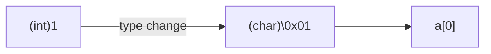

# pointer

---

## 6.1

基本概念

---

内存地址：给内存中每一个字节的编号。

地址总线的宽度：内存地址的长度大小有 16，32，64 bit.

指针变量：存储地址的变量。

某一变量的地址，称作指向该变量的指针。

---

## 6.2

variables and pointers

---

Define

```cpp
<basic type> *pointer;
```

``pointer`` 的值标志了第一个字节的地址，**基类型**决定了要取几个字节。

---

```cpp
cout << sizeof(char *) << endl;
cout << sizeof(short *) << endl;
cout << sizeof(int *) << endl;
cout << sizeof(long *) << endl;
cout << sizeof(long long *) << endl;
cout << sizeof(float *) << endl;
cout << sizeof(double *) << endl;
// all is 4 in x86 Debug
// all is 8 in x64 Debug
```

---

```cpp
short i, *p;
p = &i; // get the first address of i, return to p
```

---

```cpp
<basic type> i = 0;
<basic type> *pointer = &i;
pointer++; // pointer = pointer + 1;
```

虽然是 + 1，但是是加了基类型的大小个字节。

---

```cpp
int b, *q = &b;
cout << q << endl; // hexidecimal
char a[10];
cout << a << endl; // 乱码
char i, *p = &i;
cout << p << endl; // 乱码
cout << hex << (int *)p << endl;
```

在编译器看来，字符指针和字符数组是等价的，会把字符指针当作字符串输出。

最后一行是强制类型转换，转换了基类型，但是不存在**高位舍弃等等**。所有指针变量的大小都是相同的。

---

```cpp
char a[10] = {1, 2, 3, 4};
cout << a << endl;
```



---

```cpp
void k; // ERROR!
void *p; // CORRECT
p++; // ERROR!
p--; // ERROR!
```

---

优先级

- 前缀：2 级
- 后缀和解引用：3 级，右结合

```cpp
int i, *p = &i;
*p++; // 先 ++，再将**中间值**作为解引用，得到 i 的值
*++p; // *(++p) 解引用得到 i 后的值
(*p)++; // i++;
++*p; // ++i;
```

---

找不同

```cpp
void swap_right(int *x, int *y)
{
    int t;
    t = *x;
    *x = *y;
    *y = t;
}
void swap_wrong(int *x, int *y)
{
    int *t;
    t = x;
    x = y;
    y = t;
}
```

如何通过函数形成多个影响？使用指针进行**间接访问**。

---

```cpp
void swap_bad(int *x, int *y)
{
    int *t;
    *t = *x;
    *x = *y;
    *y = *x;
}
```

VS 报错，Dev C++ 似乎没问题。

==启发：工程的正确和它是否能正确运行无关。==

过程中间使用了**野指针**！

指针是很危险的东西，因为它看似是一个变量，但是其实获得了**另外一个变量的权限**。所以在使用指针之前，必须先分配一个变量，再让指针指向它，这样就不存在权限缺失的情况。

---

如何改正？

```cpp
void swap_bad(int *x, int *y)
{
    int tt, *t = &tt;
    *t = *x;
    *x = *y;
    *y = *x;
}
```

---

## 6.3

一维数组和指针

---

指针就是字节为元素的数组，这个数组的长度可以有 1, 2, 4, 8...

用指针引用数组元素

```cpp
int a[10], *p;
p = &a[5];
*p = 10; // a[5] = 10
```

---

```cpp
a[i] => *(a + i)
*(p+i) => p[i]
p++; // CORRECT
a++; // ERROR!!!!!
```

数组的大小和位置是一开始就固定好的，移动没有意义。

---

C/C++ 不会对数组下标和指针越界进行检查。牺牲了安全换来了速度。

```cpp
int a[10] = { 0, 1, 2, 3, 4, 5, 6, 7, 8, 9 };
cout << a[5] << endl;
cout << 6[a] << endl; // haha!
```

``6[a] == *(6+a) == a[6]``

---

效率更高的数组遍历方式

```cpp
int a[10], *p = a;
for (p = a; p < a + 10; ++p)
{
    cout << *p << endl;
}
```

---

指针进行计算时不得超过数组范围，否则==越界==。

指针变量和整数不能做乘除运算。指针和指针之间也不能相加。这都是没有意义的。

``void *`` 指针不能进行计算。

---

## 6.4

字符串与指针

---

用字符指针指向字符串

```cpp
char s[] = "string";
string s = "string";
char *p = "string";
```

---

赋值

```cpp
char *p;
p = "string"; // CORRECT
*p = "string"; // ERROR!!!
```

``*p`` 代表一个字节的内存，不能赋值字符串，可以赋值字符。

```cpp
*p = 'S';
```

---

对比数组

```cpp
char s[] = "string";
s = "string"; // ERROR!!!
strcpy(s, "string"); // #include <string.h>
```

---

```cpp
void strcpy(char *str1, const char *str2)
{
    while (*str2)
    {
        *str1++ = *str2++;
    }
    *str1 = '\0';
}
```

OR

```cpp
void strcpy(char *str1, const char *str2)
{
    while (*str1 = *str2)
    {
        str1++;
        str2++;
    }
}
```

---

==OR==

```cpp
void strcpy(char *str1, const char *str2)
{
    while (*str1++ = *str2++)
        ;
}
```

---

不好的实现方式

```cpp
void strcpy(char *str1, const char *str2)
{
    do
    {
        *str1++ = *str2++;
    } while (*str2)
    *str1 = '\0';
}
```

因为如果 ``str2`` 是空字符，会发生==越界超权限==。

---

```cpp
int main()
{
    char *p = (char*)"Hello";
    *p = 'c';
    return 0;
}
```

错误：因为指针指向了==常量==。

---

## 6.5

返回指针的函数

---

返回的指针可以是传入指针参数经过计算得到的指针，如

```cpp
int * fun(int * ptr)
{
    return ++ptr;
}
```

---

但是不能返回局部自动变量的指针：不可信。

```cpp
int * fun()
{
    int k = 1, *p;
    return p;
}
```

---

## 6.6

空指针

---

指针允许有空值 ``NULL``

```cpp
#define NULL 0
```

```cpp
char s[] = NULL; // ERROR!!!
char s[] = { NULL }; // empty string { '\0' }
```

```cpp
char *s = NULL;
strlen(s); // 不一定是 0
```

---

## 6.7

引用（C++ 新增）

---

引用的含义：变量的别名

```cpp
int a = 0, &b = a; // a, b represent the same variable.
```

引用不分配单独的空间，**和指针不同**。

引用在声明时**必须初始化**：指向同类型的变量，在生存期内都**不能再指向其他的变量**。

---

引用不能成为数组元素
```cpp
int &b[3]; // [3] 的优先级高于 &
```

不能定义指向引用的指针
```cpp
int *&p;
```

---

但是可以定义**数组的引用**、**数组元素的引用**和**指针变量的引用**。

```cpp
int a[10], (&b)[10] = a; // [10] 的优先级高于 &
int a[10], &b = a[5];
int a, *p = &a, *&b = p;
```

---

引用的常用应用：作为函数的参数，可以起到指针的作用，改变传入实参的值。

```cpp
void swap(int &a, int &b)
{
    t = a;
    a = b;
    b = t;
}
```

调用函数的时候也不需要像指针那样加取地址符。

```cpp
int main()
{
    int i = 1, j = 0;
    swap(i, j);
    cout << i << j << endl;
    return 0;
}
```

---

但是如果函数中采用了引用，这时不能将对应的实参设为常量或表达式。

```cpp
swap(3, 5);
```

这一点和指针的规则是相同的。

可以这样修改

```cpp
#include <iostream>
void print_int(const int &a)
{
    std::cout << a << std::endl;
}
int main()
{
    print_int(15);
    return 0;
}
```

形参是 ``const`` 引用时可以传入常量或表达式。

---

## 6.8

不同基类型的指针变量互相赋值

---

不同基类型指针不能够直接赋值，需要先进行强制类型转换。

```cpp
// g++ (Ubuntu 9.3.0-17ubuntu1~20.04) 9.3.0
#include <iostream>
using namespace std;
int main()
{
        long l = 0xffffffff30, *p_l // long: 8 bytes
        short *p_short = (short *)p
        char *p_char = (char *)p_lo
        cout << hex;
        cout << *p_long << endl; // ffffffff30
        cout << *p_short << endl; // ff30
        cout << *p_char << endl; // 0
        return 0;
}
```

所谓“低地址低字节”、“小端序”。

---

可以使用相似的方法解决下面的问题：

1. 如何知道 ``double`` 型数据的存储？
2. 同一个数据大小如何知道 ``double`` 和 ``float`` 类型存储的差异？
3. 如何知道某种编译器下两个变量相邻几个字节？
4. 如何知道某个函数的执行代码？
5. ......
