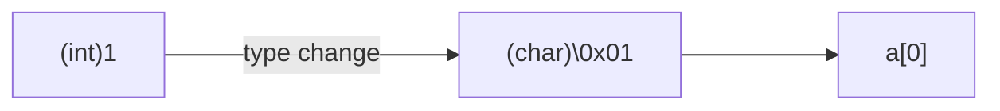

# pointer

---

## 6.1

基本概念

---

内存地址：给内存中每一个字节的编号。

地址总线的宽度：内存地址的长度大小有 16，32，64 bit.

指针变量：存储地址的变量。

某一变量的地址，称作指向该变量的指针。

---

## 6.2

variables and pointers

---

Define

```cpp
<basic type> *pointer;
```

``pointer`` 的值标志了第一个字节的地址，**基类型**决定了要取几个字节。

---

```cpp
cout << sizeof(char *) << endl;
cout << sizeof(short *) << endl;
cout << sizeof(int *) << endl;
cout << sizeof(long *) << endl;
cout << sizeof(long long *) << endl;
cout << sizeof(float *) << endl;
cout << sizeof(double *) << endl;
// all is 4 in x86 Debug
// all is 8 in x64 Debug
```

---

```cpp
short i, *p;
p = &i; // get the first address of i, return to p
```

---

```cpp
<basic type> i = 0;
<basic type> *pointer = &i;
pointer++; // pointer = pointer + 1;
```

虽然是 + 1，但是是加了基类型的大小个字节。

---

```cpp
int b, *q = &b;
cout << q << endl; // hexidecimal
char a[10];
cout << a << endl; // 乱码
char i, *p = &i;
cout << p << endl; // 乱码
cout << hex << (int *)p << endl;
```

在编译器看来，字符指针和字符数组是等价的，会把字符指针当作字符串输出。

最后一行是强制类型转换，转换了基类型，但是不存在**高位舍弃等等**。所有指针变量的大小都是相同的。

---

```cpp
char a[10] = {1, 2, 3, 4};
cout << a << endl;
```



---

```cpp
void k; // ERROR!
void *p; // CORRECT
p++; // ERROR!
p--; // ERROR!
```

---

优先级

- 前缀：2 级
- 后缀和解引用：3 级，右结合

```cpp
int i, *p = &i;
*p++; // 先 ++，再将**中间值**作为解引用，得到 i 的值
*++p; // *(++p) 解引用得到 i 后的值
(*p)++; // i++;
++*p; // ++i;
```

---

找不同

```cpp
void swap_right(int *x, int *y)
{
    int t;
    t = *x;
    *x = *y;
    *y = t;
}
void swap_wrong(int *x, int *y)
{
    int *t;
    t = x;
    x = y;
    y = t;
}
```

如何通过函数形成多个影响？使用指针进行**间接访问**。

---

```cpp
void swap_bad(int *x, int *y)
{
    int *t;
    *t = *x;
    *x = *y;
    *y = *x;
}
```

VS 报错，Dev C++ 似乎没问题。

==启发：工程的正确和它是否能正确运行无关。==

过程中间使用了**野指针**！

指针是很危险的东西，因为它看似是一个变量，但是其实获得了**另外一个变量的权限**。所以在使用指针之前，必须先分配一个变量，再让指针指向它，这样就不存在权限缺失的情况。

---

如何改正？

```cpp
void swap_bad(int *x, int *y)
{
    int tt, *t = &tt;
    *t = *x;
    *x = *y;
    *y = *x;
}
```

---

## 6.3

一维数组和指针

---

指针就是字节为元素的数组，这个数组的长度可以有 1, 2, 4, 8...

用指针引用数组元素

```cpp
int a[10], *p;
p = &a[5];
*p = 10; // a[5] = 10
```

---

```cpp
a[i] => *(a + i)
*(p+i) => p[i]
p++; // CORRECT
a++; // ERROR!!!!!
```

数组的大小和位置是一开始就固定好的，移动没有意义。

---

C/C++ 不会对数组下标和指针越界进行检查。牺牲了安全换来了速度。

```cpp
int a[10] = { 0, 1, 2, 3, 4, 5, 6, 7, 8, 9 };
cout << a[5] << endl;
cout << 6[a] << endl; // haha!
```

``6[a] == *(6+a) == a[6]``

---

效率更高的数组遍历方式

```cpp
int a[10], *p = a;
for (p = a; p < a + 10; ++p)
{
    cout << *p << endl;
}
```

